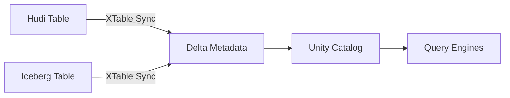

[Apache XTable](https://xtable.apache.org) (Incubating) provides cross-table omni-directional interoperability between Apache Hudi, Apache Iceberg, and Delta Lake. This integration allows you to register XTable-synced tables in Unity Catalog.

## Overview

XTable enables you to:

<CardGroup cols={2}>
  <Card title="Multi-Format Access" icon="arrows-left-right">
    Read the same table as Hudi, Iceberg, or Delta Lake
  </Card>
  <Card title="Unity Catalog Integration" icon="database">
    Register synced tables in Unity Catalog for governance
  </Card>
  <Card title="Engine Flexibility" icon="gears">
    Use different engines without reformatting data
  </Card>
  <Card title="Unified Metadata" icon="sitemap">
    Maintain consistent metadata across formats
  </Card>
</CardGroup>

## How XTable Works

XTable synchronizes metadata between table formats:



## Prerequisites

<Steps>
  <Step title="Source Tables">
    Existing Hudi or Iceberg tables in external storage (S3, GCS, ADLS, or local)
  </Step>
  
  <Step title="XTable Installation">
    Follow the [XTable installation guide](https://xtable.apache.org/docs/setup)
  </Step>
  
  <Step title="Unity Catalog">
    Clone and build Unity Catalog from [GitHub](https://github.com/unitycatalog/unitycatalog)
  </Step>
</Steps>

## Setup XTable Sync

### Create XTable Configuration

Create a YAML configuration file to define the sync process:

```yaml my_config.yaml
sourceFormat: HUDI  # or ICEBERG
targetFormats:
  - DELTA
datasets:
  - tableBasePath: s3://path/to/source/data
    tableName: table_name
    partitionSpec: partitionpath:VALUE
```

<ParamField path="sourceFormat" type="string" required>
  Source table format: `HUDI` or `ICEBERG`
</ParamField>

<ParamField path="targetFormats" type="array" required>
  Target formats to sync to (e.g., `DELTA`)
</ParamField>

<ParamField path="datasets[].tableBasePath" type="string" required>
  Storage location of the source table
</ParamField>

<ParamField path="datasets[].tableName" type="string" required>
  Name of the table
</ParamField>

<ParamField path="datasets[].partitionSpec" type="string">
  Partition specification (e.g., `partitionpath:VALUE`)
</ParamField>

### Run XTable Sync

Execute the sync process to generate Delta Lake metadata:

```bash
java -jar xtable-utilities/target/incubator-xtable-utilities-0.1.0-SNAPSHOT-bundled.jar \
  --datasetConfig my_config.yaml
```

<Note>
  After syncing, you'll see a `_delta_log` directory in your table's storage location containing Delta Lake metadata.
</Note>

## Configure Unity Catalog

### Setup Cloud Storage

Configure Unity Catalog server to access your cloud storage. Edit `etc/conf/server.properties`:

<Tabs>
  <Tab title="AWS S3">
    ```properties
    # S3 Configuration
    s3.bucketPath.0=s3://your-bucket-name
    s3.region.0=us-east-2
    s3.awsRoleArn.0=arn:aws:iam::123456789012:role/uc-role
    # Optional credentials
    s3.accessKey.0=YOUR_ACCESS_KEY
    s3.secretKey.0=YOUR_SECRET_KEY
    s3.sessionToken.0=YOUR_SESSION_TOKEN
    ```
    
    <ParamField path="s3.bucketPath.0" type="string" required>
      S3 bucket path where table data is stored
    </ParamField>
    
    <ParamField path="s3.region.0" type="string" required>
      AWS region (e.g., us-east-2)
    </ParamField>
    
    <ParamField path="s3.awsRoleArn.0" type="string">
      IAM role ARN for credential vending
    </ParamField>
  </Tab>
  
  <Tab title="Azure ADLS">
    ```properties
    # ADLS Configuration
    adls.storageAccountName.0=yourstorageaccount
    adls.tenantId.0=your-tenant-id
    adls.clientId.0=your-client-id
    adls.clientSecret.0=your-client-secret
    ```
  </Tab>
  
  <Tab title="GCS">
    ```properties
    # GCS Configuration
    gcs.bucketPath.0=gs://your-bucket-name
    gcs.jsonKeyFilePath.0=/path/to/service-account-key.json
    ```
  </Tab>
</Tabs>

### Start Unity Catalog Server

```bash
bin/start-uc-server
```

## Register Table in Unity Catalog

Register the XTable-synced table in Unity Catalog using the CLI:

```bash
bin/uc table create \
  --full_name unity.default.people \
  --columns "id INT, name STRING, age INT, city STRING, create_ts STRING" \
  --storage_location s3://path/to/source/data
```

<ParamField path="--full_name" type="string" required>
  Full table name in `catalog.schema.table` format
</ParamField>

<ParamField path="--columns" type="string" required>
  Comma-separated column definitions with types
</ParamField>

<ParamField path="--storage_location" type="string" required>
  Storage path where table data and metadata reside
</ParamField>

## Query the Table

Once registered, query the table using Unity Catalog CLI or any integrated compute engine:

### Using Unity Catalog CLI

```bash
bin/uc table read --full_name unity.default.people
```

### Using DuckDB

```sql
CREATE SECRET (
  TYPE UC,
  TOKEN 'not-used',
  ENDPOINT 'http://127.0.0.1:8080',
  AWS_REGION 'us-east-2'
);

ATTACH 'unity' AS unity (TYPE UC_CATALOG);

SELECT * FROM unity.default.people LIMIT 10;
```

### Using Apache Spark

```python
# PySpark example
spark.sql("SELECT * FROM unity.default.people").show()
```

## Complete Example: Hudi to Delta

<Steps>
  <Step title="Create XTable Config">
    ```yaml hudi_to_delta.yaml
    sourceFormat: HUDI
    targetFormats:
      - DELTA
    datasets:
      - tableBasePath: s3://my-bucket/tables/customers
        tableName: customers
        partitionSpec: country:VALUE
    ```
  </Step>
  
  <Step title="Run Sync">
    ```bash
    java -jar xtable-utilities/target/incubator-xtable-utilities-0.1.0-SNAPSHOT-bundled.jar \
      --datasetConfig hudi_to_delta.yaml
    ```
  </Step>
  
  <Step title="Configure Unity Catalog">
    ```properties etc/conf/server.properties
    s3.bucketPath.0=s3://my-bucket
    s3.region.0=us-east-1
    s3.awsRoleArn.0=arn:aws:iam::123456789012:role/uc-s3-access
    ```
  </Step>
  
  <Step title="Start UC Server">
    ```bash
    bin/start-uc-server
    ```
  </Step>
  
  <Step title="Register Table">
    ```bash
    bin/uc table create \
      --full_name unity.default.customers \
      --columns "id INT, name STRING, email STRING, country STRING, signup_date DATE" \
      --storage_location s3://my-bucket/tables/customers
    ```
  </Step>
  
  <Step title="Query Table">
    ```bash
    bin/uc table read --full_name unity.default.customers
    ```
  </Step>
</Steps>

## Complete Example: Iceberg to Delta

```yaml iceberg_to_delta.yaml
sourceFormat: ICEBERG
targetFormats:
  - DELTA
datasets:
  - tableBasePath: s3://my-bucket/warehouse/sales
    tableName: sales_data
    partitionSpec: year:VALUE,month:VALUE
```

Sync and register:

```bash
# Sync Iceberg to Delta
java -jar xtable-utilities/target/incubator-xtable-utilities-0.1.0-SNAPSHOT-bundled.jar \
  --datasetConfig iceberg_to_delta.yaml

# Register in Unity Catalog
bin/uc table create \
  --full_name unity.default.sales_data \
  --columns "order_id INT, amount DECIMAL(10,2), year INT, month INT, day INT" \
  --storage_location s3://my-bucket/warehouse/sales
```

## Bidirectional Sync

XTable supports bidirectional synchronization:

```yaml bidirectional.yaml
sourceFormat: HUDI
targetFormats:
  - DELTA
  - ICEBERG
datasets:
  - tableBasePath: s3://my-bucket/multi-format-table
    tableName: multi_format
```

This allows the same table to be queried as Hudi, Delta, or Iceberg.

## Supported Operations

<AccordionGroup>
  <Accordion title="Source Formats">
    - Apache Hudi
    - Apache Iceberg
  </Accordion>
  
  <Accordion title="Target Formats">
    - Delta Lake
    - Apache Iceberg (from Hudi)
    - Apache Hudi (from Iceberg)
  </Accordion>
  
  <Accordion title="Storage Systems">
    - AWS S3
    - Azure Data Lake Storage (ADLS)
    - Google Cloud Storage (GCS)
    - Local filesystem
  </Accordion>
  
  <Accordion title="Unity Catalog Features">
    - Table registration
    - Metadata management
    - Credential vending
    - Access control
  </Accordion>
</AccordionGroup>

## Best Practices

<CardGroup cols={2}>
  <Card title="Incremental Sync" icon="rotate">
    Run XTable sync regularly to keep metadata up-to-date
  </Card>
  <Card title="Partition Strategy" icon="layer-group">
    Use consistent partitioning across formats for better performance
  </Card>
  <Card title="Schema Evolution" icon="code-branch">
    Test schema changes before syncing to production tables
  </Card>
  <Card title="Monitor Sync" icon="chart-line">
    Set up monitoring and alerts for sync job failures
  </Card>
</CardGroup>

## Troubleshooting

<AccordionGroup>
  <Accordion title="Sync fails with metadata error">
    - Verify source table format is correct (Hudi or Iceberg)
    - Check that source table has valid metadata
    - Ensure storage location is accessible
  </Accordion>
  
  <Accordion title="Unity Catalog cannot read table">
    - Verify `_delta_log` directory exists after sync
    - Check Unity Catalog has access to storage location
    - Confirm table registration with correct column schema
  </Accordion>
  
  <Accordion title="Permission denied errors">
    - Check IAM roles/permissions for cloud storage
    - Verify credentials in `server.properties` are correct
    - Ensure service account has read/write access
  </Accordion>
  
  <Accordion title="Schema mismatch">
    - Ensure column definitions match source table schema
    - Check for schema evolution in source table
    - Re-run sync to pick up schema changes
  </Accordion>
</AccordionGroup>

## Resources

<CardGroup cols={2}>
  <Card title="XTable Documentation" icon="book" href="https://xtable.apache.org/docs">
    Official Apache XTable documentation
  </Card>
  <Card title="Unity Catalog with Hudi/Iceberg" icon="newspaper" href="https://medium.com/@kywe665/unity-catalog-oss-with-hudi-delta-iceberg-and-emr-duckdb-710ab8f8a7dc">
    Tutorial blog post
  </Card>
  <Card title="Video Tutorial" icon="video" href="https://www.youtube.com/watch?v=1SKQRrenBj4">
    Getting started with XTable and Unity Catalog
  </Card>
  <Card title="LinkedIn Guide" icon="linkedin" href="https://www.linkedin.com/pulse/getting-started-x-table-unity-catalog-universal-datalakes-soumil-shah-l3rpe/">
    Universal Datalakes hands-on lab
  </Card>
</CardGroup>

## Next Steps

<CardGroup cols={3}>
  <Card title="Apache Spark" icon="fire" href="/integrations/spark">
    Write Hudi and Delta tables with Spark
  </Card>
  <Card title="Trino" icon="server" href="/integrations/trino">
    Query multi-format tables with Trino
  </Card>
  <Card title="DuckDB" icon="database" href="/integrations/duckdb">
    Analyze Delta tables with DuckDB
  </Card>
</CardGroup>